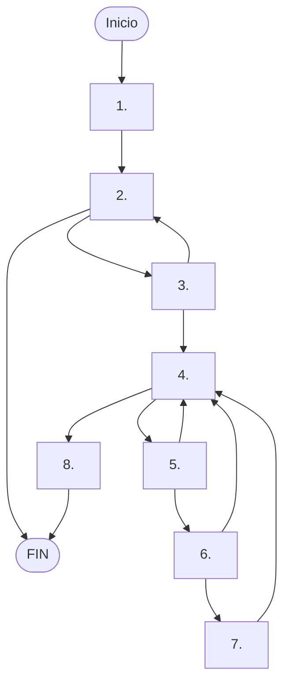

# Análisis del método buscarCursoMejorValorado

Tenemos el siguiente código:

```java	
    public Curso buscarCursoMejorValorado(String tematica, int nivel) {
        Curso mejor = null;

        for (List<Curso> sublista : listaTematicas) {
            if (!sublista.isEmpty() &&
                sublista.get(0).getTematica().equalsIgnoreCase(tematica)) {
                for (Curso c : sublista) {
                    if (c.getNivel() == nivel) {
                        if (mejor == null || c.getValoracion() > mejor.getValoracion()) {
                            mejor = c;
                        }
                    }
                }
                break;
            }
        }

        return mejor;
    }
```

vamos a suponer que empezamos a contar desde uno para la línea ' Curso mejor = null; '. Entonces nos quedaría este grafo:




